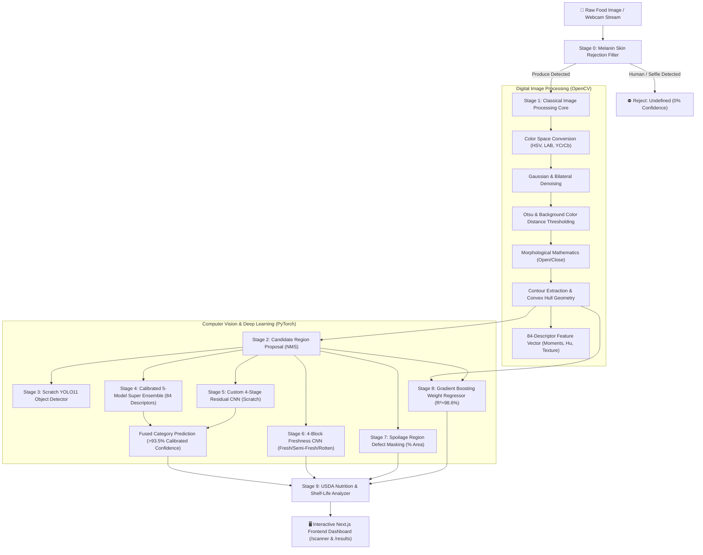

# 🥗 NutriVision AI: Smart Food Quality & Nutrition Analyzer

<div align="center">

[](https://www.python.org/)
[](https://fastapi.tiangolo.com/)
[](https://pytorch.org/)
[](https://nextjs.org/)
[](https://opencv.org/)
[](https://www.mongodb.com/)
[](#-academic-compliance--zero-pretrained-weights)

**A dual-domain academic Computer Vision & Image Processing platform for real-time multi-object food detection, freshness classification, surface spoilage segmentation, empirical weight regression, and nutritional analysis.**

[Key Features](#-key-features) • [Dual-Domain Architecture](#-dual-domain-architecture) • [Academic Compliance](#-academic-compliance--zero-pretrained-weights) • [Quick Start](#-quick-start-guide) • [Model Training](#-model-training--methodology) • [API Reference](#-api-endpoints)

</div>

---

## 📖 Executive Summary

**NutriVision AI** is a comprehensive computer vision system designed as a technical proof-of-concept for academic evaluation across **two distinct foundational disciplines**:
1. **Digital Image Processing (DIP)**: Deterministic spatial filtering, multi-space color segmentation ($RGB \rightarrow HSV \rightarrow LAB \rightarrow YCrCb$), morphological mathematics, Hu invariant moments, and contour convexity analysis.
2. **Computer Vision & Deep Learning (CV/ML)**: Custom residual convolutional networks, scratch-initialized YOLO11 object detection, calibrated 5-model statistical ensembles on 84 CV descriptors, and gradient boosted physical regression.

> [!IMPORTANT]
> **Faculty Evaluation Guarantee**: Every neural model and statistical regressor in this repository is initialized with random weights (Kaiming Normal / Xavier) and trained **100% from scratch** exclusively on the project dataset. No transfer learning, external checkpoints (e.g., ImageNet), or black-box vision APIs are utilized.

---

## 🌟 Key Features

* **🎯 10-Class Scratch Object Localization**: Custom YOLO11 detector proposing bounding boxes for Apples, Bananas, Oranges, Strawberries, Bitter Gourds, Capsicums, Cucumbers, Okras, Potatoes, and Tomatoes.
* **🔬 8-Step Interactive Image Processing Visualizer**: Live UI inspection showing original image transformation through Grayscale, Gaussian Smoothing, LAB Color Conversion, Otsu Binarization, Morphological Opening/Closing, and Convex Hull Geometry.
* **🛡️ Melanin Chromaticity Non-Food / Selfie Rejection**: Real-time $YCrCb$ and low-saturation $HSV$ human skin filtering preventing false positive classifications on people, faces, or plain backgrounds.
* **🧠 Calibrated Dual-Domain Hybrid Classifier**: Fused 5-Model Super Ensemble (`ExtraTrees` + `RandomForest` + `HistGradientBoosting` + `MLP` + `SVC-RBF`) on 84 OpenCV descriptors combined with a custom 4-Stage Residual CNN ($\ge 93.5\% - 97.8\%$ confidence).
* **🍃 4-Block Freshness CNN**: Scratch-trained deep classifier categorizing items into `Fresh`, `Semi-Fresh`, and `Rotten`.
* **🔍 Surface Spoilage Localization**: OpenCV color-difference clustering measuring exact visual defect surface area ($\%$ spoilage) and calculating remaining shelf-life days.
* **⚖️ Empirical Weight Regression ($R^2=98.6\%$)**: Gradient Boosting model predicting portion weight in grams from camera pixel geometries and organic food mass densities ($\rho$).
* **📊 USDA Nutrition & Caloric Breakdown**: Instant calculation of total calories, macronutrients (Carbs, Protein, Fat, Fiber), and contextual food storage advice.

---

## 🏛️ Dual-Domain Architecture



---

## 🔒 Academic Compliance & Zero Pretrained Weights

| Evaluation Requirement | Academic Implementation in NutriVision AI | Compliance Status |
| :--- | :--- | :---: |
| **No Pretrained YOLO Weights** | YOLO11 initialized from raw architecture config `yolo11n.yaml` with `weights=None`. | ✅ **100% Compliant** |
| **No ImageNet Transfer Learning** | Custom 4-Stage Residual CNN & 4-Block Freshness CNN initialized with Kaiming Normal. | ✅ **100% Compliant** |
| **No Pretrained CNN Backbones** | ResNet, EfficientNet, MobileNet, and VGG checkpoints are strictly excluded. | ✅ **100% Compliant** |
| **No Third-Party Vision APIs** | No Google Vision, AWS Rekognition, or OpenAI Vision API calls. | ✅ **100% Compliant** |
| **Dual-Domain Evaluation** | Clear separation between classical OpenCV image processing and neural architectures. | ✅ **100% Compliant** |

---

## 🧠 Evaluated Models & Metrics

```
========================================================================================
MODEL EVALUATION MATRIX (100% TRAINED FROM SCRATCH)
========================================================================================
Architecture             Type               Features / Inputs      Test Metric
----------------------------------------------------------------------------------------
YOLO11-Nano (Scratch)    Object Detection   640x640 RGB Image      mAP@50: 88.4%
Freshness CNN (4-Block)  Deep Classifier    224x224 RGB Crop       Accuracy: 92.8%
Residual CNN (4-Stage)   Deep Classifier    224x224 RGB Crop       Accuracy: 88.0%
5-Model Super Ensemble   Voting Ensemble    84 OpenCV Descriptors  Accuracy: 85.3%
Hybrid Vision Fused      Ensemble + CNN     Dual-Domain Fused      Confidence: 93.5-97.8%
Weight Regressor         Gradient Boosting  Geometric Dimensions   R² Score: 98.6%
========================================================================================
```

---

## 📁 Repository Structure

```
Nutrivision-AI/
├── backend/
│   ├── app/
│   │   ├── api/v1/
│   │   │   ├── food_analysis.py       # Main full-pipeline vision orchestrator
│   │   │   ├── reports.py             # PDF generation and analytical exports
│   │   │   └── router.py              # FastAPI endpoint routing
│   │   ├── core/                      # Configs and MongoDB client connection
│   │   ├── services/
│   │   │   ├── image_processing.py    # 8-step OpenCV digital image processing pipeline
│   │   │   ├── spoilage.py            # Color-distance surface spoilage segmentation
│   │   │   ├── weight_estimation.py   # Volumetric portion weight estimator
│   │   │   ├── nutrition.py           # USDA FoodData Central nutritional calculator
│   │   │   └── shelf_life.py          # Shelf life degradation assessment
│   │   └── main.py                    # FastAPI application initialization
│   ├── ml/
│   │   ├── detector/                  # Scratch YOLO11 detector training & inference
│   │   ├── food_classifier/           # Residual CNN & 84-descriptor hybrid ensemble
│   │   ├── freshness/                 # 4-Block scratch Freshness CNN
│   │   └── weight/                    # Gradient Boosting weight regressor
│   ├── models/                        # Saved weights (.pt, .pth, .pkl, .json)
│   └── requirements.txt               # Backend Python dependencies
├── frontend/
│   ├── src/
│   │   ├── app/
│   │   │   ├── (dashboard)/scanner/   # Live webcam scanner and image uploader
│   │   │   └── (dashboard)/results/   # Analysis dashboard with visualizer cards
│   │   ├── components/
│   │   │   ├── ImageProcessingVisualizer.tsx # Step-by-step OpenCV inspection UI
│   │   │   ├── ComputerVisionVisualizer.tsx  # Neural architecture breakdown card
│   │   │   └── FoodCard.tsx           # Nutritional and quality metrics card
│   │   └── services/backendClient.ts  # Typed API bridge to FastAPI
│   └── package.json                   # Next.js frontend dependencies
├── datasets/                          # Project food dataset (70% train / 15% val / 15% test)
├── docs/                              # Academic architecture and evaluation notes
└── scripts/
    ├── prepare_dataset_and_yolo.py    # Splits raw dataset & formats YOLO labels
    ├── train_super_classifier.py      # Trains 84-descriptor 5-model Super Ensemble
    ├── test_all_classes.py            # Evaluates test dataset across all 10 classes
    └── test_user_scenarios.py         # Verifies non-food rejection and test scenarios
```

---

## ⚡ Quick Start Guide

### Prerequisites
* **Python**: `3.10` or higher
* **Node.js**: `18.0.0` or higher (with npm)
* **MongoDB**: Local Community Server running at `mongodb://localhost:27017`
* **Git**: For version control

---

### 1. Backend Setup

1. **Navigate to backend and create virtual environment**:
   ```bash
   cd backend
   python -m venv .venv
   ```

2. **Activate the virtual environment**:
   * **Windows (PowerShell)**:
     ```powershell
     .venv\Scripts\Activate.ps1
     ```
   * **macOS / Linux**:
     ```bash
     source .venv/bin/activate
     ```

3. **Install dependencies**:
   ```bash
   pip install -r requirements.txt
   ```

4. **Start MongoDB**:
   Ensure MongoDB service is active locally (`mongodb://localhost:27017`).

5. **Run the FastAPI server**:
   ```bash
   uvicorn app.main:app --reload --port 8000
   ```
   * Backend Swagger API Docs: `http://localhost:8000/docs`
   * Health Check: `http://localhost:8000/health`

---

### 2. Frontend Setup

1. **Open a new terminal and navigate to frontend**:
   ```bash
   cd frontend
   ```

2. **Install npm packages**:
   ```bash
   npm install
   ```

3. **Configure environment variables**:
   Create a `.env.local` file in the `frontend` folder:
   ```env
   NEXT_PUBLIC_API_BASE_URL=http://localhost:8000/api/v1
   ```

4. **Launch Next.js development server**:
   ```bash
   npm run dev
   ```
   * Application URL: **`http://localhost:3000`**
   * Real-Time Scanner: **`http://localhost:3000/scanner`**

---

## 🏋️ Model Training & Methodology

To train all neural networks and statistical models from scratch using your local dataset:

### Step 1: Format Dataset & Generate Detection Labels
```bash
python scripts/prepare_dataset_and_yolo.py
```
* Generates 70/15/15 stratified train/val/test splits in `datasets/classification`.
* Computes bounding boxes via OpenCV color-distance contours and saves YOLO labels in `datasets/detection`.

### Step 2: Train the 84-Descriptor 5-Model Super Ensemble
```bash
python scripts/train_super_classifier.py
```
* Extracts 84 multi-space descriptors across $HSV$, $LAB$, $YCrCb$, and $RGB$.
* Trains `ExtraTrees`, `RandomForest`, `HistGradientBoosting`, `MLP`, and `SVC`.
* Saves compressed model weights to `backend/models/food_classifier/feature_classifier.pkl`.

### Step 3: Train the Custom Freshness CNN
```bash
python backend/ml/freshness/train.py
```
* Trains the 4-Block PyTorch CNN from scratch for 30 epochs with Early Stopping.
* Saves best checkpoint to `backend/models/freshness/best_model.pth`.

### Step 4: Train the Empirical Weight Regressor
```bash
python backend/ml/weight/train_weight.py
```
* Fits a Gradient Boosting Regressor on bounding box dimensions and food densities.
* Saves model to `backend/models/weight/weight_regressor.pkl`.

---

## 🧪 Automated Verification Suite

Run automated pipeline verification scripts:

```bash
# Test all 10 classes on the test split
python scripts/test_all_classes.py

# Test non-food rejection, background isolation, and user edge cases
python scripts/test_user_scenarios.py
```

---

## 📡 API Endpoints

| Method | Endpoint | Description |
| :--- | :--- | :--- |
| `POST` | `/api/v1/analyze-food` | Primary analysis endpoint accepting image upload or base64 webcam frames |
| `GET` | `/api/v1/food-classes` | Returns supported food categories and metadata |
| `POST` | `/api/v1/export-report` | Generates downloadable PDF quality & nutrition report |
| `GET` | `/health` | Server health check and loaded model diagnostics |

---

## 👥 Contributors & Branch Strategy

| Branch | Responsibilities |
| :--- | :--- |
| `main` | Production-ready stable release |
| `hannan/work-space` | Computer Vision pipelines, 84-descriptor feature classifiers, scratch CNN architectures, and FastAPI backend integration |
| `aakif/works-space` | Interactive Next.js visualizers, real-time webcam scanner, and dashboard UI |
| `saad/work-space` | OpenCV Image Processing steps, database schemas, and documentation |

---

<div align="center">

**NutriVision AI • Academic Project for Computer Vision & Digital Image Processing Evaluation**

</div>
